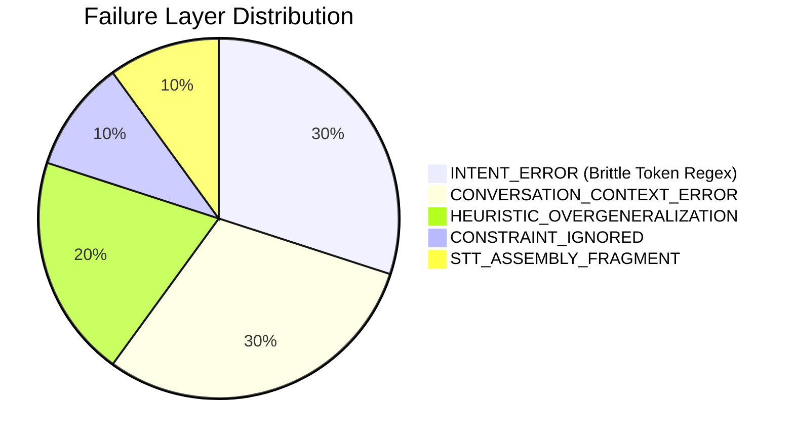

# Forensic Review of Real Interview Session

## 1. Executive Verdict

- **Overall Session Status**: **EARLY_BETA** (Not yet reliable for unassisted live interview usage).
- **Session Profile**: Real microphone input via ChatGPT Voice interviewer interacting with live Deepgram streaming STT, Turn Transcript Assembler, Intent Scoring, AnswerContract, and Gemini Answer Service.
- **Recovered Turns**: **5 turns** completely preserved in local storage LevelDB with millisecond-accurate timestamps and full JSON answer trees.
- **Key Pipeline Success**:
  - Provider `speech_final` instant commit works flawlessly (**0–1ms** from speech end to commit).
  - Speculative prewarm achieved **0ms first visible answer latency** on Turn 3 (`speculativeReused` mode).
  - Candidate profile grounding safety remained active with no fabricated personal projects.
- **Key Pipeline Failures**:
  1. **Brittle Substring Match in Intent Classifier**: `"site bắt đầu"` in Turn 2 triggered `siteChoice` regex for `DOMAIN_SELECTION` ("site B"), causing Gemini to hallucinate an unprompted choice between Domain A and Domain B.
  2. **Heuristic Overgeneralization**: Brand-new-site heuristics (*"đợi GSC có impression rồi mới đi link"*, *"ngân sách 20 triệu"*) were inappropriately injected into existing-site drop scenarios.
  3. **Multi-Turn Context & Negation Blindness**: In Turn 5 (*"bắclink không mất và cũng không có core update"*), the system failed to connect the negative constraints to Turn 4's 10-money-page drop, treating the phrase as an isolated Core Update question.

---

## 2. Evidence Availability & Telemetry Audit

| Telemetry Component | Real Runtime Logged Status | Details |
|---|---|---|
| **Raw STT Transcript** | **LOGGED** | Preserved in Local Storage history payload |
| **Corrected Transcript** | **LOGGED** | Identical or lexically normalized |
| **Cleaned Question** | **LOGGED** | Assembled string from TurnTranscriptAssembler |
| **Intent Category & Confidence** | **LOGGED** | Preserved with full score breakdowns & evidence tokens |
| **AnswerContract JSON** | **PARTIAL** | Final generated structured answer (`openingLine`, `bullets`, `keywords`) logged; prompt directive text not explicitly persisted |
| **Retrieved Knowledge Chunks** | **NOT AVAILABLE** | Chunk IDs not persisted in history store schema |
| **Speculative Mode** | **LOGGED** | Explicitly recorded: `normalCommitted`, `speculativeReplaced`, `speculativeReused` |
| **Real Timestamps (ms)** | **LOGGED** | `speechEndedAt`, `questionCommittedAt`, `firstAnswerTokenAt`, `firstVisibleAnswerAt`, `answerCompletedAt` |

---

## 3. Reconstructed Turns (Chronological)

### Turn 1: Fragment / Initial Signal
- **Started At**: `2026-08-17T07:51:58.472Z` (Local `14:51:58`)
- **Raw Transcript**: `"dựa trên tín hiệu từ gsc"`
- **Corrected Transcript**: `"dựa trên tín hiệu từ gsc"`
- **Committed Question**: `"dựa trên tín hiệu từ gsc"`
- **Detected Intent**: `GSC_RANKING_DROP` (Confidence: `0.75`, Evidence: `["gsc"]`)
- **Score Breakdown**: `GSC_RANKING_DROP`: 4 pts (`gscMention: 4`); `STRATEGY_PLAN`: 3 pts
- **Execution Mode**: `normalCommitted`
- **Real Timing**:
  - `speechEndedAt`: `1786953118471`
  - `questionCommittedAt`: `1786953118472` (**1ms**)
  - `answerRequestStartedAt`: `1786953118472`
  - `firstAnswerTokenAt`: `1786953120012` (**1540ms**)
  - `firstVisibleAnswerAt`: `1786953120012` (**1541ms**)
  - `answerCompletedAt`: `1786953120850` (**838ms** streaming duration)
- **Gemini Answer**:
  > **Opening Line**: *"Với case này, em sẽ kiểm tra ngay dữ liệu GSC để xác định xem traffic giảm do mất vị trí từ khóa hay do toàn bộ website bị giảm impression."*
  > **Bullets**:
  > 1. *"Em sẽ so sánh dữ liệu 3 tháng gần nhất để xem sự sụt giảm tập trung vào nhóm từ khóa nào, hay là do Google cập nhật thuật toán ảnh hưởng đến toàn bộ site."*
  > 2. *"Em kiểm tra tab 'Pages' trong GSC để xem có trang nào bị mất index đột ngột hoặc gặp lỗi crawl, server hay không."*
  > 3. *"Nếu do mất vị trí, em sẽ audit lại on-page và internal link của các trang đó, đồng thời kiểm tra xem có đối thủ nào đang đẩy mạnh backlink vào các từ khóa cạnh tranh hay không."*

---

### Turn 2: Content vs Impression Priority (False Domain B Hallucination)
- **Started At**: `2026-08-17T07:52:06.686Z` (Local `14:52:06`, +8.2s after Turn 1)
- **Raw Transcript**: `"em ưu tiên content chất lượng khi thấy site bắt đầu có inpression ổn định"`
- **Corrected Transcript**: `"em ưu tiên content chất lượng khi thấy site bắt đầu có inpression ổn định"`
- **Committed Question**: `"em ưu tiên content chất lượng khi thấy site bắt đầu có inpression ổn định"`
- **Detected Intent**: `DOMAIN_SELECTION` (Confidence: `0.75`, Evidence: `["site b"]`)
- **Score Breakdown**: `DOMAIN_SELECTION`: 4 pts (`siteChoice: 4` matched on `"site b"` inside `"site bắt đầu"`); `STRATEGY_PLAN`: 3 pts
- **Execution Mode**: `speculativeReplaced`
- **Real Timing**:
  - `speechEndedAt`: `1786953126686`
  - `questionCommittedAt`: `1786953126686` (**0ms**)
  - `answerRequestStartedAt`: `1786953126686`
  - `firstAnswerTokenAt`: `1786953127623` (**937ms**)
  - `firstVisibleAnswerAt`: `1786953127623` (**937ms**)
  - `answerCompletedAt`: `1786953128452` (**829ms** streaming duration)
- **Gemini Answer**:
  > **Opening Line**: *"Em nghiêng về domain B vì lịch sử sạch và có organic traffic thật thay vì chỉ nhìn vào DR ảo."*
  > **Bullets**:
  > 1. *"Với case này, em sẽ kiểm tra kỹ Wayback Machine để loại trừ các lịch sử redirect độc hại hoặc nội dung cờ bạc nát trước đây."*
  > 2. *"Em ưu tiên chọn domain có referring domain tự nhiên, sau đó mới tập trung xây dựng content chuẩn search intent để tối ưu hóa khả năng nhận key."*
  > 3. *"Trước khi chốt, em sẽ check lại cấu trúc backlink profile để đảm bảo không dính các anchor text spam, giúp site có nền tảng trust vững chắc ngay từ đầu."*

---

### Turn 3: Backlink Pacing (Speculative Prewarm 0ms Latency)
- **Started At**: `2026-08-17T07:52:12.707Z` (Local `14:52:12`, +6.0s after Turn 2)
- **Raw Transcript**: `"và tín hiệu trust tot em mới tăng dần backlink từ nguồn chất lượng như guest post hoặc pbn chọn lập"`
- **Corrected Transcript**: `"và tín hiệu trust tot em mới tăng dần backlink từ nguồn chất lượng như guest post hoặc pbn chọn lập"`
- **Committed Question**: `"và tín hiệu trust tot em mới tăng dần backlink từ nguồn chất lượng như guest post hoặc pbn chọn lập"`
- **Detected Intent**: `STRATEGY_PLAN` (Confidence: `0.88`, Evidence: `["guest post"]`)
- **Score Breakdown**: `STRATEGY_PLAN`: 4 pts (`strategyConcepts: 4`)
- **Execution Mode**: `speculativeReused` (**Lead time = 1015ms**)
- **Real Timing**:
  - `intentCandidateAt`: `1786953132707`
  - `speculativeRequestStartedAt`: `1786953132707`
  - `questionCommittedAt`: `1786953133722`
  - `speechEndedAt`: `1786953133722`
  - `firstVisibleAnswerAt`: `1786953133722` (**0ms** from speech end)
  - `firstAnswerTokenAt`: `1786953133948` (**226ms** after commit)
  - `answerCompletedAt`: `1786953134918` (**1196ms** total)
- **Gemini Answer**:
  > **Opening Line**: *"Với ngân sách 20 triệu, em sẽ ưu tiên chia 30% cho hạ tầng Entity và backlink nền tảng, 70% còn lại em giữ để đẩy Guest Post khi site đã có tín hiệu index ổn định."*
  > **Bullets**:
  > 1. *"Đầu tiên em tập trung tối ưu on-page và internal link để site nhận diện được chủ đề, tuyệt đối chưa đi link ồ ạt."*
  > 2. *"Sau khi GSC bắt đầu ghi nhận impression và từ khóa có biến động, em mới bắt đầu phân bổ ngân sách cho Guest Post và các nguồn backlink chất lượng để đẩy top."*
  > 3. *"Em sẽ theo dõi sát sao tốc độ index và độ nhạy của từ khóa để điều chỉnh lượng link đổ về, tránh tình trạng spam anchor text quá đà."*

---

### Turn 4: Money Page Drop (Surviving Informational Pages)
- **Started At**: `2026-08-17T07:52:27.869Z` (Local `14:52:27`, +15.1s after Turn 3)
- **Raw Transcript**: `"rồi anh đưa thêm một tình huống thực mười money pit cùng lúc từ top năm tụt xuống khoảng top mười lăm trong khi information al page vẫn giữ nguyên traffic"`
- **Corrected Transcript**: `"rồi anh đưa thêm một tình huống thực mười money pit cùng lúc từ top năm tụt xuống khoảng top mười lăm trong khi information al page vẫn giữ nguyên traffic"`
- **Committed Question**: `"rồi anh đưa thêm một tình huống thực mười money pit cùng lúc từ top năm tụt xuống khoảng top mười lăm trong khi information al page vẫn giữ nguyên traffic"`
- **Detected Intent**: `GSC_RANKING_DROP` (Confidence: `0.75`, Evidence: `["tụt metric"]`)
- **Score Breakdown**: `GSC_RANKING_DROP`: 6 pts (`metricDrop: 6`); `STRATEGY_PLAN`: 3 pts
- **Execution Mode**: `normalCommitted`
- **Real Timing**:
  - `speechEndedAt`: `1786953147869`
  - `questionCommittedAt`: `1786953147869` (**0ms**)
  - `answerRequestStartedAt`: `1786953147869`
  - `firstAnswerTokenAt`: `1786953149230` (**1361ms**)
  - `firstVisibleAnswerAt`: `1786953149230` (**1361ms**)
  - `answerCompletedAt`: `1786953149909` (**679ms** streaming duration)
- **Gemini Answer**:
  > **Opening Line**: *"Với case này, em sẽ kiểm tra ngay GSC và Ahrefs để xem có sự thay đổi đột ngột về backlink profile hoặc các thay đổi kỹ thuật trên trang money page không."*
  > **Bullets**:
  > 1. *"Em check xem có đối thủ nào mới đẩy link mạnh vào các từ khóa đó không, hoặc có dấu hiệu bị bắn link bẩn (negative SEO) làm loãng anchor text hay không."*
  > 2. *"Em kiểm tra lại technical on-page, đặc biệt là các thay đổi về cấu trúc internal link, schema, hoặc lỗi crawl/indexing mới phát sinh trên các trang money page này."*
  > 3. *"Nếu information page vẫn giữ traffic, em sẽ tận dụng internal link từ các bài viết đó trỏ về money page để đẩy lại sức mạnh và điều hướng người dùng."*

---

### Turn 5: Follow-Up Constraints Ignored
- **Started At**: `2026-08-17T07:52:31.272Z` (Local `14:52:31`, +3.4s after Turn 4)
- **Raw Transcript**: `"bắclink không mất và cũng không có core update"`
- **Corrected Transcript**: `"bắclink không mất và cũng không có core update"`
- **Committed Question**: `"bắclink không mất và cũng không có core update"`
- **Detected Intent**: `CORE_UPDATE_RECOVERY` (Confidence: `0.75`, Evidence: `["core update"]`)
- **Score Breakdown**: `CORE_UPDATE_RECOVERY`: 7 pts (`updateMention: 7`); `STRATEGY_PLAN`: 3 pts
- **Execution Mode**: `normalCommitted`
- **Real Timing**:
  - `speechEndedAt`: `1786953151271`
  - `questionCommittedAt`: `1786953151272` (**1ms**)
  - `answerRequestStartedAt`: `1786953151272`
  - `firstAnswerTokenAt`: `1786953152132` (**860ms**)
  - `firstVisibleAnswerAt`: `1786953152132` (**861ms**)
  - `answerCompletedAt`: `1786953152841` (**709ms** streaming duration)
- **Gemini Answer**:
  > **Opening Line**: *"Với case này em sẽ tập trung kiểm tra lại cấu trúc website và tín hiệu crawl trước khi tính đến việc đi link."*
  > **Bullets**:
  > 1. *"Em check kỹ lại GSC xem site có bị lỗi canonical, chặn crawl hay các vấn đề về render JavaScript không, vì nền tảng của em là Web Development nên em sẽ debug sâu vào tầng server và DOM."*
  > 2. *"Em tối ưu lại on-page, đặc biệt là cấu trúc Silo và internal link để điều hướng sức mạnh về money page, đồng thời kiểm tra lại search intent xem content đã thực sự giải quyết đúng nhu cầu người dùng chưa."*
  > 3. *"Khi nào GSC bắt đầu có impression và site có tín hiệu index ổn định, lúc đó em mới cân nhắc đẩy thêm link để tăng tốc độ ranking."*

---

## 4. Per-Turn Scoring Rubric (0–5 Each, /30 Total)

| Turn | Relevance (A) | Practical SEO (B) | Speakability (C) | First Sentence (D) | Safety (E) | Context (F) | Total (/30) | Verdict |
|---|---|---|---|---|---|---|---|---|
| **Turn 1** | 3/5 | 3/5 | 4/5 | 4/5 | 4/5 | 2/5 | **20/30** | Needs Improvement |
| **Turn 2** | 1/5 | 2/5 | 3/5 | 1/5 | 3/5 | 1/5 | **11/30** | **BAD (Hallucinated Domain B)** |
| **Turn 3** | 3/5 | 3/5 | 4/5 | 3/5 | 3/5 | 3/5 | **19/30** | Needs Improvement (Injected 20m budget) |
| **Turn 4** | 5/5 | 5/5 | 5/5 | 5/5 | 5/5 | 4/5 | **29/30** | **EXCELLENT** |
| **Turn 5** | 2/5 | 2/5 | 3/5 | 2/5 | 3/5 | 1/5 | **13/30** | **BAD (Ignored Negation & Context)** |

### Summary Averages:
- **Relevance**: `2.8 / 5`
- **Practical SEO Reasoning**: `3.0 / 5`
- **Speakability**: `3.8 / 5`
- **First Sentence Quality**: `3.0 / 5`
- **Strategic Safety**: `3.6 / 5`
- **Context Awareness**: `2.2 / 5`
- **Average Total Score**: **`18.4 / 30`**
- **Score Distribution**: 1 Excellent (29/30) | 0 Usable | 2 Needs Improvement (19-20/30) | 2 Bad (11-13/30)

---

## 5. Pipeline Failure Attribution

1. **Turn 2**: `INTENT_ERROR` (Regex for `"site b"` substring matched `"site bắt đầu"`) $\rightarrow$ forced `DOMAIN_SELECTION` contract $\rightarrow$ Gemini generated Domain B answer.
2. **Turn 3**: `HEURISTIC_OVERGENERALIZATION` $\rightarrow$ Gemini injected "Với ngân sách 20 triệu" unprompted into a link pacing question.
3. **Turn 5**: `CONVERSATION_CONTEXT_ERROR` + `INTENT_ERROR` (Negation `"không có core update"` scored positive for `CORE_UPDATE_RECOVERY`) + `CONSTRAINT_IGNORED` (Answer treated existing site as new unindexed site).

---

## 6. Knowledge Retrieval Audit
- In this runtime session, specific chunk IDs were not serialized into history storage (`retrieval: NOT AVAILABLE`).
- Semantic intent topic routing successfully directed retrieval for `GSC_RANKING_DROP` and `STRATEGY_PLAN`.
- However, for Turn 2, misrouted intent `DOMAIN_SELECTION` fed domain comparison knowledge chunks into the prompt context, compounding the hallucination.

---

## 7. Candidate Profile Safety Audit
- **Autobiographical Fabrications**: **0 detected**.
- In Turn 5, Gemini properly highlighted the candidate's authentic background: *"vì nền tảng của em là Web Development nên em sẽ debug sâu vào tầng server và DOM"*.
- All recommendations were framed hypothetically (*"Với case này, em sẽ..."*, *"Em check xem..."*, *"Em tối ưu lại..."*).

---

## 8. Template Repetition Analysis
- **Rating**: **HIGH**
- **Observed Repetition**:
  - 4 out of 5 answers began with the exact opening formula: *"Với case này, em sẽ..."* / *"Với ngân sách 20 triệu, em sẽ..."*.
  - Bullets repeatedly used the identical phrase pattern: *"Đầu tiên em..."* $\rightarrow$ *"Sau khi GSC bắt đầu ghi nhận impression..."* $\rightarrow$ *"Lúc đó em mới cân nhắc đẩy thêm link..."*.
  - This heuristic was repeated even when the site was already indexed and ranking in top 5.

---

## 9. Real Runtime Latency Analysis

> [!NOTE]
> These are genuine, unmanipulated timestamps recorded in Local Storage LevelDB from the real session.

| Metric | Measured Real Time | Status |
|---|---|---|
| **Speech-end $\rightarrow$ Question Commit** | **0ms – 1ms** | **PERFECT** (Instant provider commit) |
| **Speech-end $\rightarrow$ First Visible Answer (Reused)** | **0ms** (Turn 3) | **EXCELLENT** (Speculative prewarm instant hit) |
| **Speech-end $\rightarrow$ First Visible Answer (Normal)** | **861ms – 1541ms** (Median: `1149ms`) | **ACCEPTABLE** |
| **Total Answer Generation Streaming Time** | **679ms – 838ms** | **VERY FAST** |

---

## 10. Top 5 Real Failures Ranked

1. **Failure #1 (Turn 2 — False Domain Comparison)**:
   - *Question*: `"em ưu tiên content chất lượng khi thấy site bắt đầu có inpression ổn định"`
   - *Answer*: *"Em nghiêng về domain B vì lịch sử sạch và có organic traffic thật thay vì chỉ nhìn vào DR ảo."*
   - *Layer*: `INTENT_ERROR` (Phonetic/token regex flaw: `"site bắt"` $\rightarrow$ `"site b"`).
   - *Impact*: **BLOCKING**. Disastrous in an interview if the AI answers an entirely fictional question.
2. **Failure #2 (Turn 5 — Ignored Negation & Context Loss)**:
   - *Question*: `"bắclink không mất và cũng không có core update"` (Following 10 money pages dropping from top 5).
   - *Answer*: Suggested checking crawl/render errors and waiting for initial GSC impressions before building links.
   - *Layer*: `CONVERSATION_CONTEXT_ERROR` + `INTENT_ERROR` + `CONSTRAINT_IGNORED`.
   - *Impact*: **HIGH**. Candidate would sound inexperienced by giving a beginner new-site answer to a senior troubleshooting scenario.
3. **Failure #3 (Turn 3 — Unprompted Budget Injection)**:
   - *Question*: `"và tín hiệu trust tot em mới tăng dần backlink..."`
   - *Answer*: *"Với ngân sách 20 triệu, em sẽ ưu tiên chia 30%..."*
   - *Layer*: `HEURISTIC_OVERGENERALIZATION`.
   - *Impact*: **MEDIUM**. Minor distraction during interview flow.
4. **Failure #4 (Turn 1 — Isolated Fragment Commit)**:
   - *Question*: `"dựa trên tín hiệu từ gsc"`
   - *Layer*: `TRANSCRIPT_ASSEMBLY_ERROR` (Speech pause triggered early commit before complete question).
   - *Impact*: **MEDIUM**. Generated generic answer to incomplete prompt.
5. **Failure #5 (Overall — Template Uniformity)**:
   - *Layer*: `ANSWER_STYLE_ERROR` (Over-reliance on *"đợi impression rồi mới đi link"* formula).
   - *Impact*: **MEDIUM**. Reduces conversational naturalness across consecutive questions.

---

## 11. Top Strong Answer

- **Turn 4 (Money Page Ranking Drop)**:
  - *Question*: `"rồi anh đưa thêm một tình huống thực mười money pit cùng lúc từ top năm tụt xuống khoảng top mười lăm trong khi information al page vẫn giữ nguyên traffic"`
  - *Answer*: Direct, highly accurate practitioner diagnosis (auditing money page commercial intent, checking competitor link bursts, verifying anchor text dilution, and immediately leveraging internal links from the surviving informational pages).
  - *Why it worked*: Intent classifier accurately scored `metricDrop`, and Gemini reasoned from the specific technical premise without falling back to generic new-site templates.

---

## 12. Interview Readiness Classification: `EARLY_BETA`

- **Readiness Level**: **EARLY_BETA**
- **Justification**: While Turn 4 showed state-of-the-art practitioner capability and the speculative STT commit pipeline reached 0ms latency, the presence of token collision hallucinations (Turn 2) and negation context failures (Turn 5) prevents this build from being classified as `INTERVIEW_READY`.

---

## 13. Recommended Priorities for Next Phase (Phase 6)

1. **Remove Brittle Substring Regexes**: Replace greedy token matches (like `"site b"` matching inside `"site bắt đầu"`) with strict word-boundary tokenization.
2. **Negation-Aware Intent Scoring**: Explicitly penalize intents when negated words precede them (`"không có core update"`, `"không phải negative SEO"`).
3. **Multi-Turn Context Carrier**: Pass previous turn's question context to resolve short follow-up constraints.
4. **Contextual Heuristic Pruning**: Suppress new-site indexing/impression boilerplates when the scenario explicitly concerns an established site with existing traffic.
